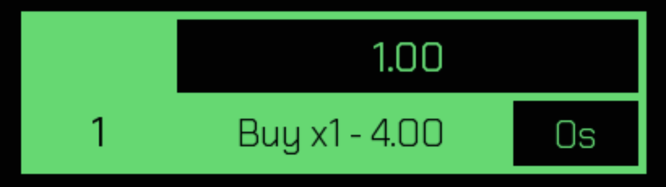
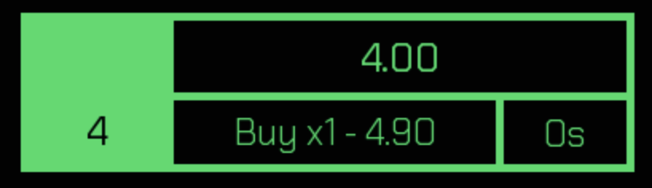
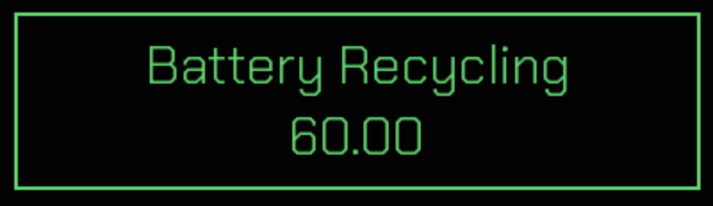

# How To Play

## Tasks

### Using Tasks

The following is a task. You earn money by clicking on them, and it has a cooldown. Once the cooldown is over, you earn the money projected in the box. (In the image below, you earn $1 per cooldown)

### Buying Investments

Buying investments is buying extra of a task. The Buy xMultiplier button in the task button, is the amount required to buy x amount of a task. In this example, when you reach $4 total, you're able to buy an investment of the task. Once you do, the amount gets added by the base income and the amount increases. The more investments you buy, the more expensive the next investment.

In the image below, I have 4 investments in this task, and the income is now $4, because 4 (amount of investments) times 1 (base income) is 4.

### Buying a Task

At the start, all tasks that aren't the first one are not available and you'll need to buy them. Once you have enough money, you can buy the task. New tasks cost more, but give more income, however have longer cooldowns.

### Buy Multipliers

The top right button on the screen says "Buy x1". This means that currently when you're buying a task or an investment, you're only buying x1 of them at a time. If you want to progress faster, you can buy x10 or x100 of them at a time, but you'll need to make sure you have enough money. To change the multiplier, just click on the Buy x(Amount) button.

## Shop

The shop can be used to buy simple upgrades.

### Managers

Managers run your tasks automatically so that you don't have to keep clicking them. You can only buy a manager for each task once.

### Upgrades

Upgrades can be bought for a 3x profit boost to the task you wish to upgrade.

## Unlocks

Unlocks are milestones you reach in investments. They happen in every task at 25, 50, 100, 200, 300, 400 and 500.

At 25, 50, 100, 200, 300 and 400, the tasks double their profit speed. At 500, most tasks double their profit, except for Recycled Cables, which quadruples its profit (x4) and reaching 500 on Battery Recycling grants a x11 profit boost to Wind Turbine Installation.

## Save System

The save system is very shallow, only saving the money you had. However, if you have a lot of money, you can load in your previous money and you can always buy back everything in the shop and all your investments.